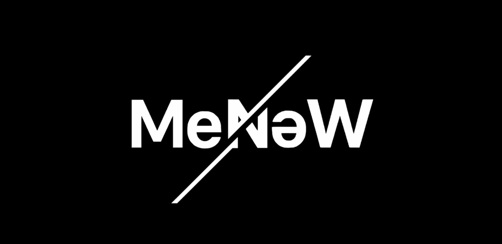
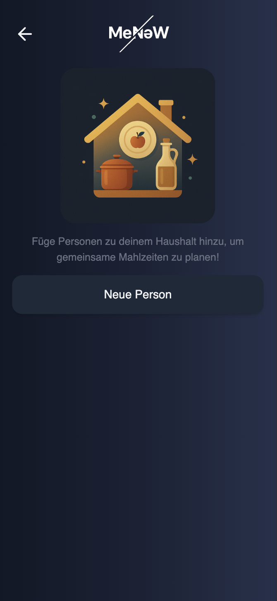
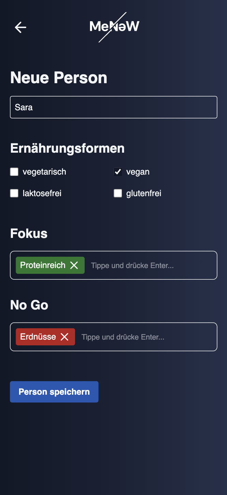
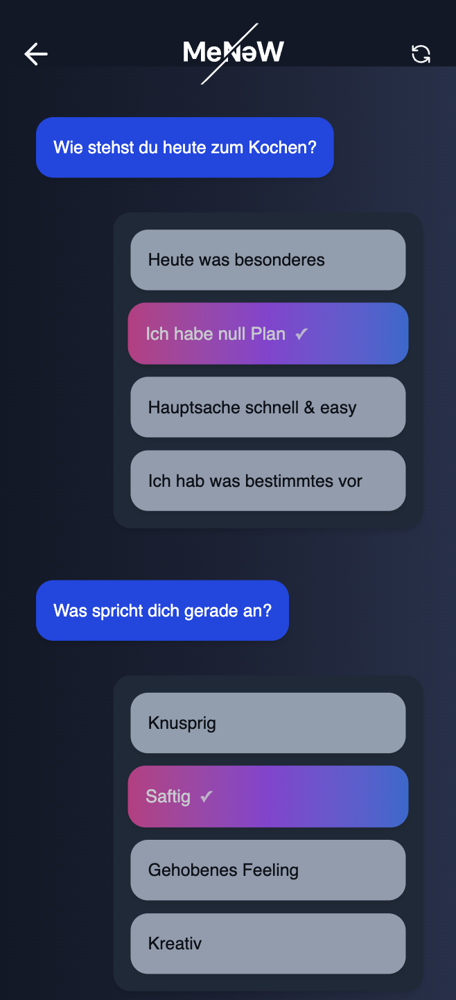

# MeNeW 

Simple webinterface for managing household members and plan meals. Utilizes GenAI for meal inspiration.

The whole application was developed in a weekend as part of the [BärnHäckt](https://www.bernhackt.ch/) hackathon.


## Impressions

[](./Screencast.mp4)







## Configuration

Make sure to set the following environment variables:

```bash
API_KEY=your_openai_api_key
```
